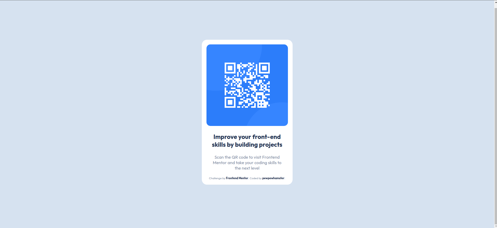

# Frontend Mentor - QR code component solution

This is a solution to the [QR code component challenge on Frontend Mentor](https://www.frontendmentor.io/challenges/qr-code-component-iux_sIO_H). Frontend Mentor challenges help you improve your coding skills by building realistic projects. 

## Table of contents

- [Overview](#overview)
  - [Screenshot](#screenshot)
  - [Links](#links)
- [My process](#my-process)
  - [Built with](#built-with)
  - [What I learned](#what-i-learned)
  - [Continued development](#continued-development)
  - [Useful resources](#useful-resources)
- [Author](#author)
- [Acknowledgments](#acknowledgments)

## Overview

### Screenshot

### Links

- Solution URL: [HTML](https://github.com/gian-noche/frontend-mentor-qr-code/blob/main/index.html)
              : [CSS](https://github.com/gian-noche/frontend-mentor-qr-code/blob/main/style.css)
- Live Site URL: (https://gian-noche.github.io/frontend-mentor-qr-code/)

## My process

### Built with

- Semantic HTML5 markup
- CSS custom properties
- Flexbox
- Mobile-first workflow

### What I learned

The main take-away for me on this challenge is that on simple designs like this,
the normal flow of elements is enough to achieve the required layout with just
a few adjustments with the spacing and alignment.

### Continued development

Using the simplest way to center items is something I need to improve on as this was
the part that took me the longest to figure out for the container.

### Useful resources

- [MDN](https://developer.mozilla.org/en-US/docs/Learn/CSS/Howto/Center_an_item)
- [CSS Tricks](https://css-tricks.com/centering-css-complete-guide/) 

## Author

- Linkedin - [Gian Levi Noche](https://www.linkedin.com/in/giannoche/)
- Github - [pewpewhamster (gian-noche)](https://github.com/gian-noche)
- Frontend Mentor - [@gian-noche](https://www.frontendmentor.io/profile/gian-noche)

## Acknowledgments

Thank you Frontend Mentor for this challenge!